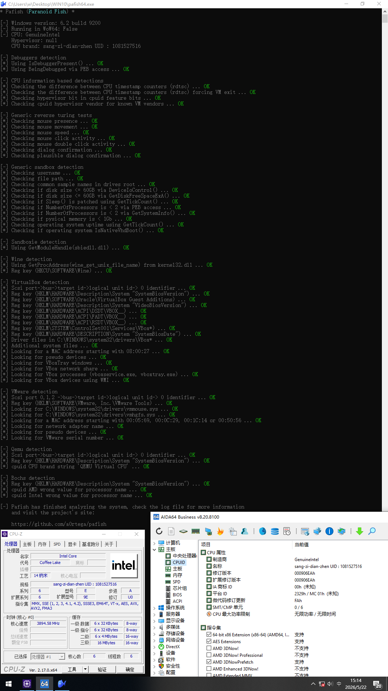

# QEMU虚拟机全仿真	 全过[pafish](https://github.com/a0rtega/pafish)测试	[al-khaser](https://github.com/ayoubfaouzi/al-khaser)[剩余2项]
## 	作者 / 桑梓店镇	UID : 1081527516
### 灵感启发[記得晚安JDWA](https://space.bilibili.com/3546570985311169)
 > ##### 目录结构	虚拟机过测试/
 >> ##### 内核修改.sh	通过	//	(rdtsc) forcing VM exit	测试
 >> ##### 准备工作.sh	安装所需虚拟化软件, 显卡直通准备工作
 >> ##### QEMU修改.sh	通过	//	Bochs detection	SystemBiosVersion	测试
 > ##### 补丁/
 >> ##### 内核补丁\[amd].patch	//	来自[RDTSC-KVM-Handler](https://github.com/WCharacter/RDTSC-KVM-Handler)	AMD补丁已过时且未测试
 >> ##### 内核补丁\[Intel].patch	//	来自[RDTSC-KVM-Handler-v2](https://github.com/YungBinary/RDTSC-KVM-Handler-v2)
 >> ##### \[ACPI-SMBIOS]补丁.patch	//	参考资源[SMBIOS风扇](https://zhuanlan.zhihu.com/p/1931453712074780725)[ACPI风扇](https://zhuanlan.zhihu.com/p/1931837516459250831)[ACPI热区](https://zhuanlan.zhihu.com/p/1955416296675084161)
 >> ##### qemu-11.0.1.patch	//	来自[qemu-anti-detection](https://github.com/zhaodice/qemu-anti-detection)
 > ##### 钩子脚本/	来自[single-gpu-passthrough](https://gitlab.com/risingprismtv/single-gpu-passthrough)	//	单GPU直通返回脚本
 > ##### VM/
 >> ##### 问题/	//	可能遇到的问题
 >> ##### 开发/	//	修改QEMU源代码开发补丁
 >> ##### 模板.xml	仿真模板
 >> ##### 配置BIOS.sh	配置仿真模板

### 视频教程	:	[QEMU虚拟机全仿真,全过pafish测试，单显卡直通过检测](https://www.bilibili.com/video/BV1YvVe6WECL)
### 文字教程	:	


## 1 : **内核修改** 打开<内核修改.sh>更改设置

**更改CPU=??**  
**更改username=??**

- /补丁
  > Intel处理器复制内核补丁\[Intel].patch  
  > AMD处理器复制内核补丁\[amd].patch	注意AMD补丁已过时且未测试  
  > 到 /home/你的用户名/  

```
sudo su	#root用户执行
bash /内核修改.sh

y安装, y安装, 自定义配置或直接方向键右<Exit>回车<Yes>回车
等待完成!!内核修改需要时间非常多!

重启
验证内核版本是否为 7.0.13
uname -r
```

## 2 : **准备工作** 打开<准备工作.sh>更改设置

**更改username=??**  

**更改CPU=??**  
**更改GPU=??**  

```
sudo su	#root用户执行
bash /准备工作.sh

y安装, 直接按俩下回车
```

## 3 : **QEMU修改** 打开<QEMU修改.sh>更改设置

**更改QEMU_YL=??**  
**更改username=??**

- /补丁
  > 复制补丁qemu-11.0.1.patch  
  > 复制补丁\[ACPI-SMBIOS]补丁.patch  
  > 复制qemu-11.0.2.tar.xz源码压缩包	//	[qemu源码](https://www.qemu.org/)   
  > 到 /home/你的用户名/  

```
bash /QEMU修改.sh

y安装编译QEMU依赖, sudo密码
```

## **创建并配置虚拟机** 打开虚拟系统管理器

```
创建新的虚拟机	....不教

打开虚拟系统管理器 首选项 启用XML编辑
复制虚拟机<uuid>XML 到/VM/模板.xml
全选复制/VM/模板.xml  覆盖虚拟机XML

/*	*	*	XML配置SMBIOS暂时无用	*	*/不用做这个步骤
sudo bash /配置BIOS.sh
自定义或复制主机  复制修改到虚拟机XML
/*	*	*	XML配置SMBIOS暂时无用	*	*/
```

## **准备显卡直通** 打开VM操作系统

```
下载显卡驱动
下载安装远程连接软件如ToDesk

设置ToDesk安全密码, 在另一台设备[手机]上连接
关闭VM操作系统

管理器添加硬件
USB主机设备，添加鼠标、键盘、耳机等USB设备
PCI主机设备，找显卡如01:00:0,  03:00:0
不要添加显卡功能[通常是HDMI音频]如01:00:1, 03:00:1  后缀:1 不要添加

cd 目录到 ??/虚拟机过测试/钩子脚本
sudo bash install_hooks.sh
重启

启动虚拟机会黑屏, 在另一台设备[手机]上连接, 安装显卡驱动
安装好显卡驱动应该显示Windows桌面， 关闭VM应该回到debian登录界面
```



- 为了爱
  > 桑梓店镇		UID : 1081527516  已完整测试2026-06-29  
  > Debian13系统\[13.5.0]  
  > Intel处理器\[i5-8400]  AMD显卡\[vega 56]  win10虚拟机\[LTSC-2019]  
  > 项目围绕Intel处理器  


[可能遇到的问题](VM/问题/可能遇到的问题)  
[更新日志](VM/问题/更新日志)


